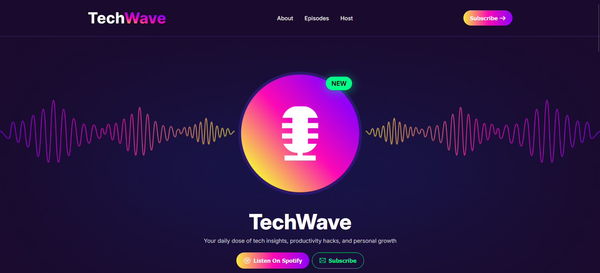

# TechWave — Podcast & Tech Insights Platform

A visually stunning podcast platform landing page built entirely with raw HTML & CSS — featuring a live-feel animated sound wave, vibrant gradient UI, and full responsiveness across all devices. Zero JavaScript, zero libraries — just pure CSS mastery.



🔗 **Live Demo:** [techwave-bd.netlify.app](https://techwave-bd.netlify.app)

---

## ✨ Features

- Animated sound wave effect built with pure CSS — no JavaScript
- Vibrant gradient design with a modern dark theme
- Fully responsive across mobile, tablet, and desktop
- Custom UI components crafted entirely from scratch
- Spotify-style CTA buttons with smooth hover effects
- Clean navigation with hamburger menu for mobile
- Embedded YouTube video links in episode cards
- "New" badge with precise positioning on podcast circle

---

## 🛠️ Tech Stack


---

## 📁 Project Structure

```
tech-wave/
├── index.html
├── styles/
│   └── style.css
├── assets/
│   └── (images & icons)
└── README.md
```

---

## 🚀 Run Locally

```bash
# Clone the repository
git clone https://github.com/Morshedul-developer/tech-wave.git

# Open in browser
cd tech-wave
open index.html
```

---

## 📸 Sections

- **Navbar** — Responsive navigation with gradient CTA button
- **Banner** — Animated sound wave with podcast circle view
- **About** — Stats section with 4 key metrics
- **Why Choose** — 5 feature cards with icons
- **Featured Episodes** — 3 episode cards with YouTube links
- **Host** — Host profile with social media links
- **Footer** — Clean centered footer

---

## 📬 Contact

**Morshedul Islam**
- Portfolio: [morshedul-khaer.netlify.app](https://morshedul-khaer.netlify.app)
- GitHub: [@Morshedul-developer](https://github.com/Morshedul-developer)

---

> *"Every pixel handcrafted — no framework, no shortcuts, no compromise."*
